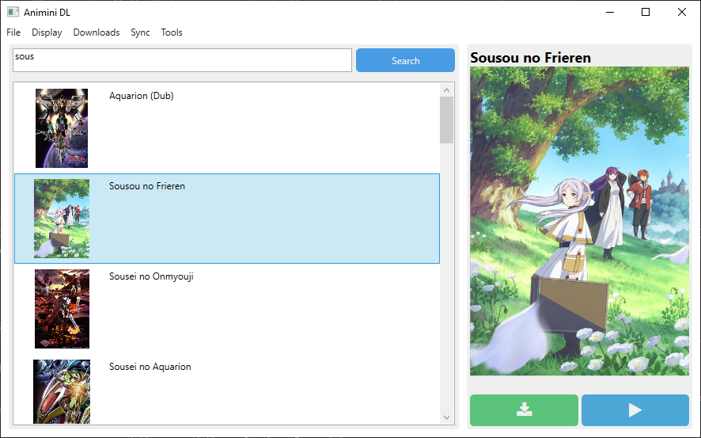

# Animini-DL 🌟

Animini-DL brings you a simple and user-friendly experience to download or stream your favorite animes, all without intrusive ads.

## Features
- Anime Downloading: Download your favorite animes effortlessly, allowing you to enjoy them offline at your convenience.

- Download Quality Options: Choose the quality of your downloads to tailor the viewing experience to your preferences.

- Episode Range Selection: Select a specific range of episodes for downloading, ensuring you have exactly what you want.

    ### Planned Features
    - Anime Streaming: Soon, you'll be able to stream your favorite animes.

    - Download Queue Display: Track of your downloads with a convenient display of the download queue.

## Screenshots 🖼

## Where did my files gone ?

The downloads goes to **user directory in Animinid**

(You can change the save directory from appSettings.json)
## Related 🔗

Here are some related projects

[Consumet-API](https://github.com/consumet/api.consumet.org) - this project currently use this api 

